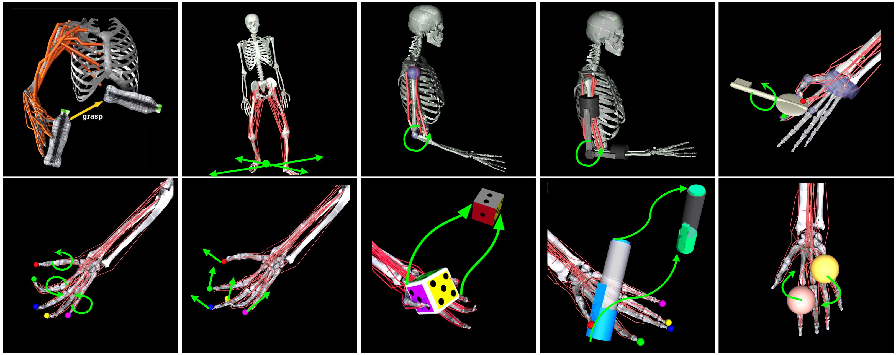
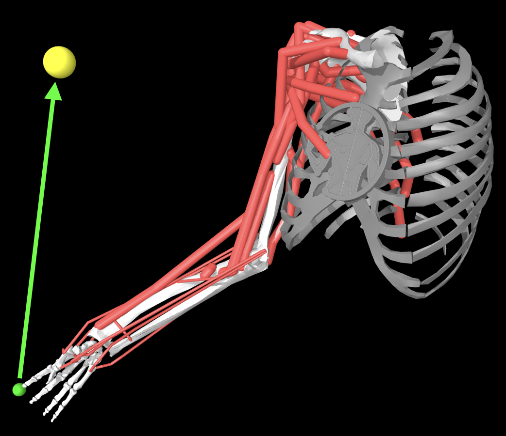
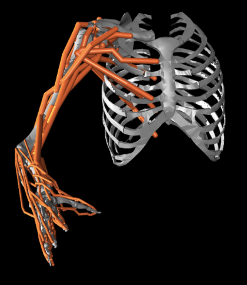
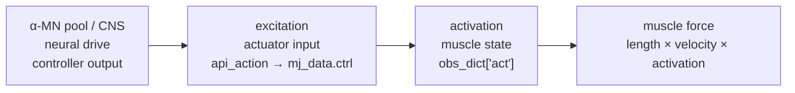

# MyoSuite myoArm Reaching 入門

`myoArmReachRandom-v0` を研究で使うためのモデル・API・評価の基礎。

本稿は、MyoSuite の上肢到達タスク `myoArmReachRandom-v0` / `myoArmReachFixed-v0` を新規 myoArm 研究プロジェクトで使うための実践的な入門である。公式ドキュメント、手元の `myosuite 2.12.1` 実測値、旧 `myoarm-lambda-ep` の経験を分けて整理する。

## 1. これはどのモデルか

MyoSuite は、MuJoCo 上で動く筋骨格モデルとタスクの collection であり、Gym / Gymnasium 互換 API で強化学習や閉ループ制御を試せる framework である。公式 docs では、MyoSuite は myoFinger、myoElbow、myoHand、myoArm、myoLeg、myoTorso などのモデルと、reaching、pose、manipulation、locomotion などのタスクを含むと説明されている。



このプロジェクトで使ってきたのは、その中の **Arm Reach** タスクである。具体的な環境名は次の通り。

- `myoArmReachFixed-v0`: 固定 target への到達
- `myoArmReachRandom-v0`: ランダム target への到達

タスクの目的は、**示指先端 site `IFtip` を target site `IFtip_target` に近づける**ことである。公式 docs でも Arm Reach の objective は「index finger tip で target に reach する」と説明されている。



> [!NOTE]
> MyoSuite は suite 名であり、単一モデル名ではない。本稿の対象は MyoSuite 全体ではなく、`myoArmReachRandom-v0` / `myoArmReachFixed-v0` という myoArm reaching 環境である。

## 2. 手元環境での実測仕様

手元の `myosuite 2.12.1`、MuJoCo 3.6.x 系で `myoArmReachRandom-v0` を開くと、主要仕様は次の通りだった。

| 項目 | 値 |
|---|---|
| 環境名 | `myoArmReachRandom-v0` |
| 観測ベクトル | `obs.shape == (80,)` |
| 作用空間 | `Box(-1.0, 1.0, (34,), float32)` |
| MuJoCo `nq, nv, nu` | `20, 20, 34` |
| MuJoCo timestep | `0.002 s` |
| MyoSuite `frame_skip` | `10` |
| 制御周期 `dt` | `0.02 s` |
| tip site | `IFtip` |
| target site | `IFtip_target` |

> [!WARNING]
> 公式 docs の Arm Reach 説明には「20 joints and 32 muscle-tendon units」とあるが、手元の `myosuite 2.12.1` では action 次元と actuator 数は 34 だった。研究で数値を報告するときは、必ず使用バージョンで `env.unwrapped.mj_model.nq`, `nv`, `nu`, `env.action_space` を実測して明記する。

## 3. myoArm の構造

`myoArmReachRandom-v0` は、20 個の generalized coordinates / velocities を持つ上肢モデルを、34 個の筋 actuator で駆動する環境として扱える。




旧プロジェクトでは、次のように解釈していた。

- 肩: 3 DoF
- 肘: 2 DoF
- 前腕: 1 DoF
- 手首: 2 DoF
- 手 / 示指: 残りの関節自由度
- actuator: 34 個の Hill 型 muscle-tendon units

この構造により、運動制御問題は単なる 3D endpoint reaching ではなく、20 DoF の姿勢冗長性と 34 筋の筋冗長性を含む。

### 3.1 順運動学・逆運動学・順動力学・逆動力学

myoArm reaching を読むときは、運動学と動力学を分けると混乱しにくい。

| 英語 | 日本語 | 入力 | 出力 | 何を問うか |
|---|---|---|---|---|
| forward kinematics | 順運動学 | 関節角 `q` | 手先位置・姿勢 `x` | この関節姿勢なら手先はどこにあるか |
| inverse kinematics | 逆運動学 | 目標手先位置・姿勢 `x*` | 関節角 `q*` | そこへ手先を置くにはどの関節姿勢が必要か |
| forward dynamics | 順動力学 | 状態 `(q, qdot)` と力・トルク・筋活動 | 次の状態・運動 | この入力を加えると身体はどう動くか |
| inverse dynamics | 逆動力学 | 運動 `(q, qdot, qddot)` | 必要な力・トルク | この運動を実現するにはどの力・トルクが必要か |

運動学は「形と位置」の関係を扱い、質量・慣性・重力・筋力を直接は扱わない。動力学は、質量・慣性・重力・接触・筋力を含めて、力と運動の関係を扱う。

```text
順運動学: q -> x
逆運動学: x* -> q*

順動力学: (q, qdot, force/torque/activation) -> q_next
逆動力学: (q, qdot, qddot) -> required force/torque
```

旧 `myoarm-lambda-ep` で問題になったのは、主に「逆運動学的に target へ向かう参照姿勢や参照筋長を作る」だけでは、重力下で姿勢を保つための逆動力学的な補償、つまり必要な筋活動・関節トルクの計算が不足しうる、という点である。

## 4. Action と activation

Gym API 上の action は 34 次元で、`env.action_space` は `Box(-1.0, 1.0, (34,), float32)` として見える。一方、筋 actuator の生理的解釈では、入力を「0 = 活性なし」「1 = 最大活性」の excitation / activation として扱いたくなる。MyoSuite には `normalize_act=True` の設定があり、Gym action を内部 actuator range へ remap する可能性があるため、研究用 controller が出す値をそのまま `env.step()` に渡す前に、実際の変換を確認する必要がある。

> [!WARNING]
> `action` という語は混同しやすい。Gym の `action` は API 入力であり、神経生理学的な action / motor command と同じではない。本稿では、以後できるだけ `api_action`、`ctrl`、`excitation`、`activation`、`neural_command` を区別する。

用語を分けると、信号の流れは次のようになる。

```text
neural_command
  = abstract descending command
        ↓ action_adapter
api_action
  = Gym action passed to env.step(api_action)
        ↓ MyoSuite remap / clipping / normalization
ctrl
  = MuJoCo actuator control in mj_data.ctrl
        ↓ MuJoCo muscle activation dynamics
activation
  = muscle activation state, e.g. obs_dict["act"]
        ↓ muscle force-length-velocity dynamics
joint torque / movement
```

用語の対応は次の通り。

- `api_action`: Gym API への入力。通常 `[-1, 1]^34`。
- `ctrl`: MuJoCo actuator control。`env.unwrapped.mj_data.ctrl` で確認する。
- `excitation`: 筋 actuator へ入る入力として `[0, 1]` で解釈したい量。
- `activation`: activation dynamics 後の内部状態。`obs_dict["act"]` など。
- `neural_command`: CNS / 脊髄 / 運動ニューロン drive として解釈する抽象量。

`activation` は EMG や α 運動ニューロン発火率そのものではなく、せいぜいその proxy である。新規プロジェクトでは、controller の出力を直接 `env.step()` に渡すのではなく、明示的な adapter を挟む。

```python
neural_command = controller(state)
api_action = action_adapter(neural_command)
obs, reward, terminated, truncated, info = env.step(api_action)
```

### 4.1 excitation, activation, force

神経生理学的に対応づけるなら、α 運動ニューロン pool の出力は筋への neural drive であり、筋モデルでは `excitation` に近い量として扱う。ただし、これは実際の単一運動ニューロン発火率を直接表すものではなく、筋 actuator へ入る正規化された入力である。excitation が筋に入ると、筋の内部状態である `activation` が活性化動力学に従って変化し、その activation と筋長・筋速度から筋力が発生する。



この意味で、MyoSuite の `obs_dict["act"]` は「筋が現在どれだけ活性化しているか」というシミュレータ内部状態であり、EMG や α 運動ニューロン発火率そのものではない。しかし、筋活動の強さと関係するため、EMG amplitude や neural drive の代理指標、すなわち proxy として解析に使うことはできる。

旧 `myoarm-lambda-ep` では、controller が出した `a_total` を `env.step(a_total)` に渡していた。この `a_total` は、概念上は 34 筋への descending command / excitation である。ただし、`env.action_space` が `[-1, 1]^34` として定義されている以上、`[0, 1]^34` を直接渡したときに MyoSuite 内部の `mj_data.ctrl` や `obs_dict["act"]` がどう解釈されるかは、バージョンごとに検査する。

### 4.2 Signal-dependent noise は標準では入っていない

手元の `myosuite 2.12.1` の `myoArmReachRandom-v0` では、Harris-Wolpert 型の signal-dependent noise、つまり筋出力や運動指令が大きいほどばらつきも大きくなる motor noise は標準では入っていないと考える。

MyoSuite 標準の処理は大きく言えば次の通りである。

```text
api_action
  -> action_space で clip
  -> normalize_act=True なら muscle actuator input へ写像
  -> MuJoCo step
```

この mapping は deterministic であり、筋出力に比例するノイズではない。MyoSuite には sensor noise 用の仕組みもあるが、これは観測値に入るノイズであって、運動指令・excitation・筋力生成に由来する signal-dependent noise とは別物である。

したがって myoArm で SDN を扱うなら、研究側で明示的に実装する必要がある。解釈がきれいなのは、Gym の `api_action` に直接ノイズを足すのではなく、`neural_command` または `excitation` 側にノイズを入れてから `action_adapter` で `api_action` に変換する設計である。

```python
u = controller(state)  # neural_command or excitation, ideally [0, 1]
noise = sigma * np.abs(u) * rng.normal(size=u.shape)
u_noisy = np.clip(u + noise, 0.0, 1.0)

api_action = action_adapter(u_noisy)
obs, reward, terminated, truncated, info = env.step(api_action)
```

ここで `sigma` は、平均 command に対する標準偏差の比例係数である。

```text
std(noise_i) = sigma * |u_i|
```

比較実験では、`sigma=0` を deterministic baseline とし、複数の `sigma` で endpoint error、jerk、effort、成功率を報告する。SDN を入れた条件で controller が滑らかな到達運動を獲得するなら、「滑らかさを軌道として手で与えた」のではなく、「信号依存ノイズ下の task error を抑える制御として出てきた」と議論しやすくなる。

確認用の最小コード:

```python
import numpy as np

for name, action in {
    "minus_one": -np.ones(34),
    "zero": np.zeros(34),
    "plus_one": np.ones(34),
}.items():
    obs, info = env.reset(seed=0)
    obs, reward, terminated, truncated, info = env.step(action.astype(np.float32))
    print(name)
    print("mj_data.ctrl[:5] =", env.unwrapped.mj_data.ctrl[:5])
    print("obs_dict['act'][:5] =", env.unwrapped.obs_dict["act"][:5])
```

手元環境での actuator 名は次の通り。

| index | actuator | index | actuator |
|---:|---|---:|---|
| 0 | `DELT1` | 1 | `DELT2` |
| 2 | `DELT3` | 3 | `SUPSP` |
| 4 | `INFSP` | 5 | `SUBSC` |
| 6 | `TMIN` | 7 | `TMAJ` |
| 8 | `PECM1` | 9 | `PECM2` |
| 10 | `PECM3` | 11 | `LAT1` |
| 12 | `LAT2` | 13 | `LAT3` |
| 14 | `CORB` | 15 | `TRIlong` |
| 16 | `TRIlat` | 17 | `TRImed` |
| 18 | `ANC` | 19 | `SUP` |
| 20 | `BIClong` | 21 | `BICshort` |
| 22 | `BRA` | 23 | `BRD` |
| 24 | `ECRL` | 25 | `ECRB` |
| 26 | `ECU` | 27 | `FCR` |
| 28 | `FCU` | 29 | `PL` |
| 30 | `PT` | 31 | `PQ` |
| 32 | `APL` | 33 | `OP` |

## 5. Observation と `obs_dict`

手元環境では、`env.reset()` が返す観測ベクトルは 80 次元だった。`obs_dict` には、少なくとも次の key がある。

| key | shape | 意味 |
|---|---:|---|
| `time` | `(1,)` | シミュレーション時刻 |
| `qpos` | `(20,)` | 関節位置 |
| `qvel` | `(20,)` | 関節速度 |
| `act` | `(34,)` | 筋 activation |
| `tip_pos` | `(3,)` | `IFtip` の 3D 位置 |
| `target_pos` | `(3,)` | target の 3D 位置 |
| `reach_err` | `(3,)` | 到達誤差ベクトル |

手元の `obs_keys` / `ordered_obs_keys` は次の通りだった。

```text
['qpos', 'qvel', 'tip_pos', 'reach_err', 'act']
```

したがって 80 次元の観測は次の和として説明できる。

```text
20 + 20 + 3 + 3 + 34 = 80
```

## 6. Target sampling

`myoArmReachRandom-v0` の target は `IFtip_target` site として表現される。手元環境の `target_reach_range` は次の範囲だった。

```text
IFtip:
  low  = (-0.35, -0.42, 0.98)
  high = ( 0.00, -0.07, 1.83)
```

これは target が直方体範囲からサンプルされることを意味する。ただし、この範囲のすべてが実際に同じ難易度で reachable とは限らない。旧プロジェクトでは、reach distance が大きく、一部 target は controller の評価を歪める可能性があった。

> [!NOTE]
> 新規プロジェクトでは、まず target sampling を制御する。いきなり random range 全体を使うのではなく、q0 からの距離、方向、z 高さ、可到達性を管理した target set を作る。

## 7. 時間刻みと episode

MuJoCo の物理積分 timestep は 2 ms、MyoSuite の `frame_skip` は 10 なので、controller が action を更新する周期は次の通り。

```text
Δt = 0.002 × 10 = 0.02 s
```

旧実験では、この 20 ms を運動学指標の時間刻みとして使った。特に jerk は三階微分なので、2 ms と 20 ms を取り違えると値が大きく変わる。

### 7.1 jerk の計算

旧 `myoarm-lambda-ep` の多くの実験では、tip 位置列 `positions`、つまり `IFtip` の 3D 軌跡 `(x_t, y_t, z_t)` から、前進差分で速度、加速度、jerk を計算していた。

```python
vel = np.diff(positions, axis=0) / dt
speed = np.linalg.norm(vel, axis=1)
acc = np.diff(vel, axis=0) / dt
jerk = np.diff(acc, axis=0) / dt
```

これは数式では概ね次に対応する。

```text
v_t = (x_{t+1} - x_t) / Δt
a_t = (v_{t+1} - v_t) / Δt
j_t = (a_{t+1} - a_t) / Δt
```

したがって `jerk` は `m/s^3` の単位を持つ。ここでの `jerk` は各時刻の瞬間的な jerk ベクトル列である。一方、論文や実験で報告する `jerk_rms` は、その時系列を一つの smoothness 指標に要約した値である。minimum-jerk 理論で最小化されるのも、単一時刻の jerk ではなく、運動全体にわたる jerk の二乗積分である。離散データでは、これを RMS や積分和で近似する。

旧実験の `jerk_rms` は、運動窓内の 3D jerk ベクトルのノルム二乗を平均し、平方根を取る。

```text
jerk_rms = sqrt((1 / N) Σ_{t=onset}^{offset} ||j_t||^2)
```

これは「運動中に平均してどれくらい急激に加速度が変化したか」を表す。値が小さいほど、加速度変化が穏やかで、軌跡は滑らかと解釈される。ただし `jerk_rms` は運動距離や運動時間に依存する。距離や時間の違う運動を厳密に比較する場合は、次のような normalized jerk も併用する方がよい。

```text
J_norm = (T^5 / D^2) ∫_0^T ||j(t)||^2 dt
```

ここで `T` は運動時間、`D` は始点から終点までの直線距離である。

ここで運動窓、つまり movement window とは、エピソード全体のうち「実際に手先が動いている区間」だけを切り出した時間範囲である。MyoSuite の episode には、開始直後の静止、到達後の保持、target 周辺の wandering が含まれる。これらを全部含めて jerk や peak speed を計算すると、到達運動そのものの滑らかさではなく、停止後の揺れや drift を測ってしまう。そのため、tip speed から運動区間を検出する。

旧実装では、tip speed が 0.02 m/s を初めて超えた index を `onset`、つまり運動開始時点とした。その後、少なくとも 5 step 以上経ってから speed が 0.02 m/s 未満に戻った index を `offset`、つまり運動終了時点とした。`onset` と `offset` は英語で「開始」と「終了」の意味であり、この区間 `[onset, offset]` だけを使って `jerk_rms`、peak speed、velocity-peak ratio、straightness を計算する。コード上は `src/myoarm/exp_utils.py` の `compute_kinematics()` に対応する。

ヒト実験でも、jerk そのものをセンサで直接測ることは通常しない。多くの場合、モーションキャプチャやマーカー位置から手先位置を時系列として取得し、フィルタリングや平滑化を行った上で、速度・加速度・jerk を数値微分で推定する。したがって、MyoSuite でも「観測された手先位置列から jerk を推定する」という考え方はヒト kinematics 解析と対応している。ただし、微分はノイズに非常に敏感なので、サンプリング周期、フィルタ、運動窓の定義を条件間で揃えることが重要である。

> [!WARNING]
> `np.diff` を 3 回使うということは、位置差分を 3 回取り、そのたびに `dt` で割るということである。したがって jerk の値は `1 / (Δt)^3` に比例する。たとえば正しい制御周期は `Δt = 0.02 s` だが、誤って MuJoCo 内部 timestep の `0.002 s` を使うと、分母が 10 分の 1 になる。それを 3 回掛けるので、`(0.02 / 0.002)^3 = 10^3 = 1000` 倍大きな jerk を報告してしまう。

MuJoCo の 2 ms timestep で jerk を計算してはいけない、という意味ではない。もし 2 ms ごとに `IFtip` 位置を保存しているなら、その 2 ms サンプル列に対して `dt = 0.002 s` を使って jerk を計算するのは一貫している。間違いなのは、20 ms ごとに保存した位置列に対して、`dt = 0.002 s` を代入することである。旧実験では action 更新ごとの tip 位置、つまり 20 ms サンプルを使っていたため、`dt = 0.02 s` が正しい。新規プロジェクトで 2 ms の高頻度記録を使う場合は、ヒトデータとの比較のために平滑化・再サンプリング・同一フィルタ条件を明示する必要がある。

### 7.2 horizon の意味

手元環境の `env.unwrapped.horizon` は 150 だった。これは Gym / MyoSuite の episode 上限であり、150 control steps 後に環境側が truncation / timeout を返しうる、という意味である。`dt = 0.02 s` なので、150 step は次に相当する。

```text
150 × 0.02 = 3 s
```

一方、旧実験コードの多くは独自 loop で `max_steps=600` を指定していた。600 control steps は次に相当する。

```text
600 × 0.02 = 12 s
```

しかし、`max_steps=600` は Python 側の loop 上限にすぎない。環境の `horizon` が 150 のままなら、`env.step()` は 150 step 目で `truncated=True` を返す。旧実験コードは多くの箇所で `if term or trunc: break` としていたため、環境側の `horizon` を 600 に変更していなければ、実際の軌跡は 12 s ではなく 3 s で止まる。

したがって、「12 s シミュレーションを行う」と言うには、単に `max_steps=600` にするだけでは不十分である。研究用に 12 s 記録したい場合は、次のように `horizon` を明示的に設定する。

```python
env = gym.make("myoArmReachRandom-v0")
env.unwrapped.horizon = 600
```

別案として、環境の `truncated` を無視して stepping を続ける設計もありうる。ただし後者は Gym episode semantics から外れるため、基本的には `horizon` を 600 に設定する方が明確である。新規プロジェクトでは、Gym の termination / truncation を尊重するのか、研究用に独自 horizon を設定するのかを必ず記録する。

## 8. Reward と研究用 metrics

MyoSuite の環境には RL 用の reward が定義されている。手元環境では次の設定だった。

```text
rwd_keys_wt = {'reach': 1.0, 'bonus': 4.0, 'penalty': 50}
far_th = 1.0
```

ただし、神経筋骨格制御の研究では、環境 reward だけでは不十分である。少なくとも次の metrics を別途計算する。

- minimum tip error
- final tip error
- movement onset / offset
- peak speed
- velocity-peak ratio
- normalized jerk / jerk RMS
- straightness
- effort / activation norm
- co-contraction
- target direction error
- static holding drift
- perturbation recovery

特に新規プロジェクトでは、reaching の前に **静的保持** と **静的 target equilibrium** を評価する。

## 9. よく使う最小コード

環境を開いて基本仕様を確認するコード:

```python
import gymnasium as gym
import myosuite  # noqa: F401

env = gym.make("myoArmReachRandom-v0")
uw = env.unwrapped
obs, info = env.reset(seed=0)
m = uw.mj_model

print(obs.shape)
print(env.action_space)
print(m.nq, m.nv, m.nu)
print(m.opt.timestep, uw.frame_skip, uw.dt)
print(uw.obs_dict.keys())
print(uw.tip_sids, [m.site(s).name for s in uw.tip_sids])
print(uw.target_sids, [m.site(s).name for s in uw.target_sids])
print([m.actuator(i).name for i in range(m.nu)])
```

target と tip 位置を得る:

```python
od = env.unwrapped.obs_dict
tip = od["tip_pos"]
target = od["target_pos"]
err = od["reach_err"]
```

旧実装では、`reach_err` の符号を安全に扱うため、しばしば次のように target を復元していた。

```python
target = tip + reach_err
```

## 10. seed 再現性の注意

旧プロジェクトでは、MyoSuite 2.12.x + MuJoCo 3.6.x + Gymnasium 1.2.x の組み合わせで、`env.reset(seed=N)` が同じ target を再現しない挙動を確認した。原因は、target sampling が環境固有の RNG 再シードより前に走るためだった。

対策として、旧プロジェクトでは `src/myoarm/env_utils.py` の `deterministic_reset(env, seed)` を使った。新規プロジェクトでも、同一 seed 条件で比較するなら、最初にこの挙動を検査する。

> [!WARNING]
> seed reproducibility は制御器比較の前提である。同じ seed で target が変わると、controller 差と target 差が混ざる。新規プロジェクトでは、環境バージョンごとに `env.reset(seed=N)` と `deterministic_reset` の挙動を必ず確認する。

## 11. 新規プロジェクトでの使い方

新規 myoArm プロジェクトでは、MyoSuite myoArm reaching を次の順に使うのがよい。

1. API 確認: `nq, nv, nu, obs_dict, target range, dt` を実測する。
2. 静的保持: target を無視して q0 を保てる tonic controller を作る。
3. 静的 target equilibrium: いくつかの target で hold error を測る。
4. 動的 reaching: 初めて movement trajectory / policy を評価する。
5. random target: 可到達性と距離分布を管理してから random validation に進む。
6. perturbation / altered gravity: controller の一般性を検査する。

旧 `myoarm-lambda-ep` の失敗から学ぶべき点は、random reaching の headline metric に進む前に、静的な平衡と posture control を検証することである。

## 12. 読むべき一次情報

1. MyoSuite 公式サイト: suite 全体の位置づけ。
2. MyoSuite docs, Models and Tasks: myoArm と Arm Reach の公式説明。
3. Caggiano et al. 2022: MyoSuite 論文。
4. MuJoCo 論文: 物理エンジンとしての背景。
5. MyoSuite GitHub / installed package: 実際に使うバージョンの XML と env code。

## 13. 参考文献

Caggiano, V., Wang, H., Durandau, G., Sartori, M., & Kumar, V. (2022). MyoSuite: A contact-rich simulation suite for musculoskeletal motor control. In *Proceedings of the 4th Annual Learning for Dynamics and Control Conference* (PMLR 168, pp. 492-507). https://proceedings.mlr.press/v168/caggiano22a.html

MyoSuite Authors. (2026). *MyoSuite documentation: Models and Tasks*. Accessed 2026-05-09. https://myosuite.readthedocs.io/en/latest/suite.html

MyoSuite Authors. (2026). *MyoSuite 2.0: contact-rich framework for musculoskeletal motor control*. Accessed 2026-05-09. https://sites.google.com/view/myosuite

Todorov, E., Erez, T., & Tassa, Y. (2012). MuJoCo: A physics engine for model-based control. In *2012 IEEE/RSJ International Conference on Intelligent Robots and Systems* (pp. 5026-5033). https://doi.org/10.1109/IROS.2012.6386109

Seth, A., Hicks, J. L., Uchida, T. K., Habib, A., Dembia, C. L., Dunne, J. J., Ong, C. F., DeMers, M. S., Rajagopal, A., Millard, M., Hamner, S. R., Arnold, E. M., Yong, J. R., Lakshmikanth, S. K., Sherman, M. A., Ku, J. P., & Delp, S. L. (2018). OpenSim: Simulating musculoskeletal dynamics and neuromuscular control to study human and animal movement. *PLoS Computational Biology, 14*(7), e1006223. https://doi.org/10.1371/journal.pcbi.1006223

## 14. 移動時の注意

この Markdown 版は Obsidian vault 内の次の構成で保存している。

- 本文: `20_research/myoArm_Reaching_Primer.md`
- 図: `20_research/assets/myoarm-reaching-primer/`

別の新規プロジェクトへ移すときは、この Markdown と `assets/myoarm-reaching-primer/` を一緒に移す。

## 15. 図版クレジット

- `assets/myoarm-reaching-primer/fig_myoarm.pdf`
  - Source: generated locally for the `myoarm-lambda-ep` educational textbook.
  - Purpose: conceptual overview of the myoArm reaching model used in this repository.
  - License: project-local educational asset; keep with this document when moving.
- `assets/myoarm-reaching-primer/myosuite_all.png`
  - Source: MyoHub/myosuite GitHub repository, `docs/source/images/myoSuite_All.png`
  - URL: https://github.com/MyoHub/myosuite
  - Repository license: Apache-2.0
  - Purpose: official overview image of MyoSuite tasks.
- `assets/myoarm-reaching-primer/myoarm_official.png`
  - Source: MyoHub/myosuite GitHub repository, `docs/source/images/myoArm.png`
  - URL: https://github.com/MyoHub/myosuite
  - Repository license: Apache-2.0
  - Purpose: official myoArm model image.
- `assets/myoarm-reaching-primer/myoarm_reach_official.png`
  - Source: MyoHub/myosuite GitHub repository, `docs/source/images/myoArmReach.png`
  - URL: https://github.com/MyoHub/myosuite
  - Repository license: Apache-2.0
  - Purpose: official myoArm reach task image.
